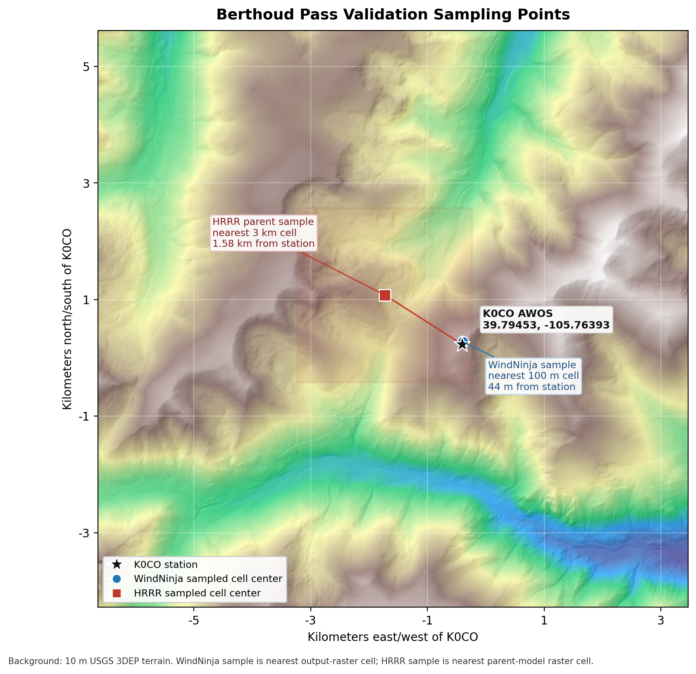

# Validation Guide

Validation compares WindNinja output against Synoptic station observations. It is
an advanced workflow with an external auth dependency: the Synoptic token must
belong to an account with weather-data access.

## Recommended Path

For Berthoud Pass, use the study wrapper:

```bash
./deploy/gcp/mwn.sh validate-study berthoud_pass \
  --start 202601010000 \
  --pilot-hours 3
```

Then scale the same command to a longer window:

```bash
./deploy/gcp/mwn.sh validate-study berthoud_pass \
  --start 202601010000 \
  --end 202601080000 \
  --chunk-hours 24
```

The study wrapper:

- reads explicit stations from `config/stations/berthoud_pass_validation_manifest.csv`
- prepares Synoptic metadata and WindNinja point coordinates for those stations
- runs HRRR reanalysis without `--points-file`
- keeps per-chunk run directories under `runtime/temp/`
- compares WindNinja and parent-model rasters with `validate-rasters`
- writes aggregate HRRR outputs under `runtime/validation/berthoud_pass/`

Station selection is intentionally simple: edit the manifest CSV to choose one
station or a short list of stations, then rerun the same command. The study
workflow does not search for stations automatically.

The Berthoud manifest currently includes:

| Station | Label | Height handling |
|---------|-------|-----------------|
| K0CO | Berthoud Pass - Mines Peak AWOS | Uses Synoptic wind sensor metadata when available |
| CABTP | Berthoud Pass CAIC | Height override intentionally blank; uses Synoptic wind sensor metadata when available, otherwise the 10 m study default |
| USGS-394759105464101 | Berthoud Pass USGS Meteorological Station | USGS wind speed/direction observations; height unknown, uses the 10 m study default for now |

Historical `validate-study` runs are HRRR only because WindNinja exposes native
HRRR pastcast but not native NBM pastcast. NBM remains available for native
forecast runs through `./deploy/gcp/mwn.sh run --model NBM`.

Common Berthoud study keys:

| Study key | Purpose | Output root |
|-----------|---------|-------------|
| `berthoud_pass` | Multistation K0CO, CABTP, and USGS validation | `runtime/validation/berthoud_pass/` |
| `berthoud_pass_k0co` | K0CO-only momentum-solver validation | `runtime/validation/berthoud_pass_k0co/` |
| `berthoud_pass_k0co_mass` | K0CO-only mass-solver validation | `runtime/validation/berthoud_pass_k0co_mass/` |
| `berthoud_pass_k0co_cabtp` | K0CO+CABTP native momentum baseline; CABTP height is provisional 5 m | `runtime/validation/berthoud_pass_k0co_cabtp/` |
| `berthoud_pass_k0co_cabtp_mass` | K0CO+CABTP native mass baseline; currently partial unless rerun | `runtime/validation/berthoud_pass_k0co_cabtp_mass/` |

The two-station K0CO+CABTP baseline is useful when comparing K0CO against the
nearby CAIC station without including the USGS pass station. The mass version
was paused after two daily chunks in the current local workspace, so do not use
that output root as a complete Jan-Apr result unless it has been rerun to 90
chunks.

## Berthoud Sampling Points



For the current K0CO setup, raster validation samples the nearest WindNinja
100 m output cell, about 44 m from the AWOS location, and the nearest parent
HRRR 3 km cell, about 1.58 km from the AWOS location. Synoptic observations are
truth data only; HRRR still drives WindNinja.

## Current Berthoud Baseline

The current multistation HRRR baseline covers completed chunks from
2026-01-01 00:00 UTC through 2026-02-01 00:00 UTC: 3 stations and 2,145
deduplicated matched station-hours in the plotting output. This is a useful
proof of concept, not yet a final
research-quality result, because CABTP and the USGS station still need verified
anemometer heights. For now all unresolved heights use the 10 m study default.

Pooled headline metrics:

| Metric | WindNinja | HRRR |
|--------|-----------|------|
| Speed MAE | 7.88 mph | 10.10 mph |
| Speed bias | 1.41 mph | 3.98 mph |
| Direction MAE | 56.20 deg | 51.36 deg |
| Vector RMSE | 13.67 mph | 14.56 mph |

Station-level metrics are more important than pooled values. The plotting
workflow writes `station_metrics.csv` with sample counts, observation height
source, parent/WindNinja sample distance, speed bias, speed MAE/RMSE, vector
RMSE, skill scores, bootstrap confidence intervals, and direction MAE filtered
to observed speed >= 5 mph and >= 10 mph.

The clean research question is:

> Does WindNinja terrain downscaling improve parent-model winds at point
> stations in complex terrain near Berthoud Pass?

## K0CO Height-Adjusted HRRR Experiment

`validate-k0co-height-hrrr` is a focused K0CO-first experiment. It is not a
replacement for the baseline `validate-study` workflow. It uses HRRR 10 m and
80 m winds plus HRRR surface height, samples GMTED2010 at 500 m, blends U/V
vectors toward the 80 m wind where coarse terrain sits above HRRR's smoothed
surface, and feeds the adjusted speed/direction grid into WindNinja as gridded
initialization.

The current preferred setting is:

```bash
--adjustment-setting exposure-gate-400m-10-80-cap
```

That setting adds a simple 3 km TPI exposure gate and caps speed relative to the
HRRR 10 m/80 m level envelope. It adjusts HRRR points at the coarse adjusted
forcing grid; it does not pre-warp the final WindNinja high-resolution terrain.

The first output compares observed K0CO, HRRR, and adjusted HRRR:

```bash
./deploy/gcp/mwn.sh validate-k0co-height-hrrr \
  --start 202601010000 \
  --end 202604010000 \
  --chunk-hours 24 \
  --adjustment-setting exposure-gate-400m-10-80-cap \
  --hrrr-only
```

The full run also feeds the adjusted HRRR grids into WindNinja:

```bash
./deploy/gcp/mwn.sh validate-k0co-height-hrrr \
  --start 202601010000 \
  --end 202604010000 \
  --chunk-hours 24 \
  --adjustment-setting exposure-gate-400m-10-80-cap \
  --skip-native
```

Outputs are written under
`runtime/validation/berthoud_pass_k0co_height_hrrr_exposure_gate_400m_10_80_cap/`
for the current preferred setting. Use `--skip-native` only when the normal K0CO
HRRR validation samples already exist.

Completed K0CO Jan-Apr metrics for the current setting:

| Result | Speed MAE | Bias | Direction MAE | Vector RMSE |
|--------|-----------|------|---------------|-------------|
| HRRR | 8.66 mph | -8.16 mph | 18.61 deg | 12.23 mph |
| Adjusted HRRR | 4.66 mph | -0.56 mph | 18.76 deg | 9.95 mph |
| WindNinja from HRRR | 8.89 mph | -7.80 mph | 17.77 deg | 12.76 mph |
| Momentum WindNinja from adjusted HRRR | 6.61 mph | -3.09 mph | 15.78 deg | 10.66 mph |
| Mass WindNinja from adjusted HRRR | 15.29 mph | +14.82 mph | 19.30 deg | 20.37 mph |

Use momentum WindNinja for the adjusted-HRRR path at K0CO. The mass-solver run
overspeeds K0CO and is not the recommended path.

For assumptions, diagnostics, and the tuning path, see
[K0CO Height-Adjusted HRRR V1 Assessment](k0co_height_hrrr_v1_assessment.md).

## Plotting Results

Generate static plots from completed chunk samples:

```bash
./deploy/gcp/mwn.sh plot-validation \
  --study-root runtime/validation/berthoud_pass \
  --title "Berthoud Pass Validation - January 2026"
```

The plot command reads `runtime/validation/berthoud_pass/chunks/*/samples.csv`,
deduplicates overlapping station-hours, and writes SVG plots plus an `index.html`
to `runtime/validation/berthoud_pass/plots/`. It can be rerun while a long
validation job is active; it only includes chunks that have already completed.

Outputs include:

- wind speed time series
- wind speed error time series
- direction absolute error time series
- observed-vs-modeled speed scatter
- daily error metrics
- terrain-backed station sampling maps when `station_metadata.json` and rasters are present
- `station_metrics.csv` with station-level skill, bias, and confidence intervals
- `plot_summary.json` with the plotted sample count and headline metrics

For manual HRRR validation, use the lower-level flow:

1. Prepare station metadata with `synoptic-points`.
2. Run HRRR reanalysis without `--points-file`.
3. Keep the run directory with `--keep-temp`.
4. Compare WindNinja and parent HRRR rasters with `validate-rasters`.

```bash
./deploy/gcp/mwn.sh run --mode reanalysis \
  --start 202601010000 --end 202601010300 \
  --model HRRR \
  --domain berthoud_pass \
  --keep-temp --no-upload

./deploy/gcp/mwn.sh validate-rasters \
  --run-dir runtime/temp/berthoud_pass_20260101_0000_reanalysis_3h_HRRR \
  --metadata-file runtime/validation/berthoud_pass/station_metadata.json \
  --start 202601010000 --end 202601010300 \
  --samples-csv runtime/validation/berthoud_pass/manual_3h_samples.csv \
  --station-summary-csv runtime/validation/berthoud_pass/manual_3h_station_summary.csv \
  --group-summary-csv runtime/validation/berthoud_pass/manual_3h_group_summary.csv \
  --summary-json runtime/validation/berthoud_pass/manual_3h_summary.json
```

## Important Constraints

- WindNinja rejects `input_points_file` when `momentum_flag = true`.
- For momentum validation, do not pass `--points-file`; use `validate-rasters`
  after the run.
- Interrupted reanalysis windows do not resume. Rerun the chunk cleanly.
- Station selection is explicit. Add or remove rows in the station manifest.
- Start with a 3-hour smoke test, then a 24-hour pilot, before scaling to longer
  windows.
- `validate-study --plan` prints chunk/run paths without network calls or writes.
- `MWN_NUM_THREADS=6` is the current high-thread test setting on a 6-physical /
  12-logical CPU machine. OpenFOAM should not be set above physical cores.

## More Detail

- [Command reference](commands.md#validate-rasters) - validation command syntax
- [Command reference](commands.md#validate-study) - chunked validation studies
- [Agent handoff](agent_handoff.md#synoptic-validation) - known auth and runtime caveats
